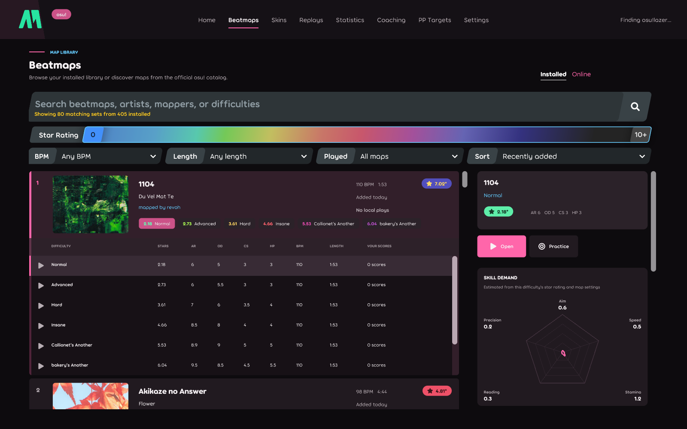
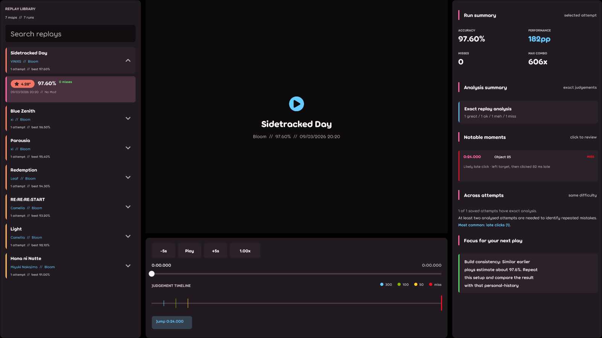
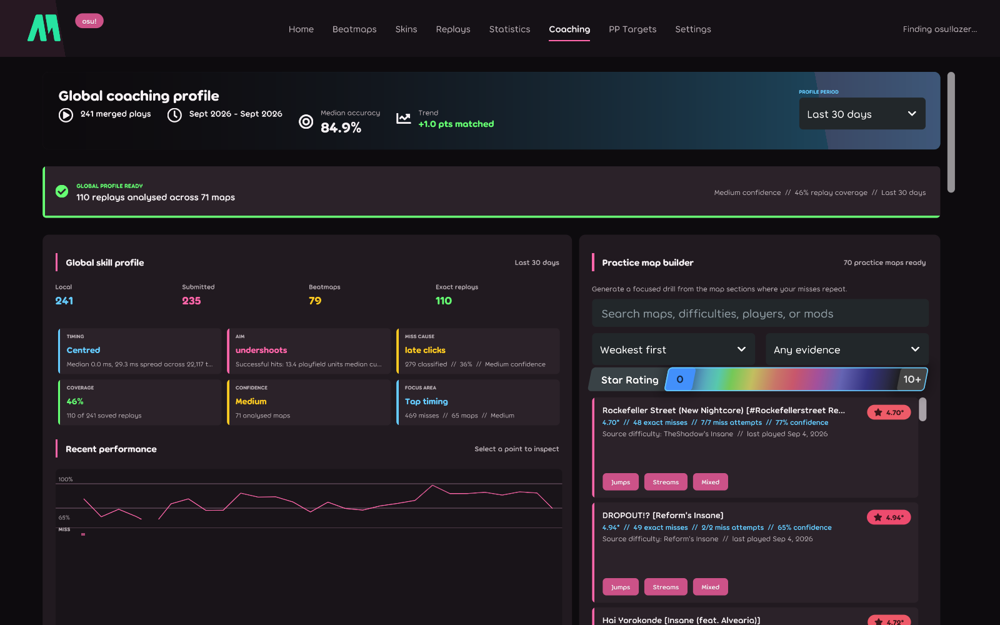

# AimMod

AimMod is a performance-analysis and coaching suite for osu! and KovaaK's Aim Trainer. Each game has a dedicated desktop client and release channel built around the data and practice workflow that game exposes.

| Product | Platforms | Download |
| --- | --- | --- |
| AimMod for osu! | Windows x64, Linux x64 | [Stable channel](https://github.com/veryCrunchy/aimmod/releases/tag/aimmod-osu-stable) |
| AimMod for KovaaK's | Windows | [Latest release](https://github.com/veryCrunchy/kovaaks/releases/latest) |

## AimMod for osu!

AimMod for osu! is a native osu.Framework desktop application. It combines local osu!stable and osu!lazer history, replay-backed object analysis, and online scores into one workspace for map discovery, performance review, coaching, and focused practice.

### Beatmap intelligence and PP targets



- Browse installed beatmaps and inspect each difficulty separately
- Compare aim, speed, stamina, reading, and accuracy demand
- Calculate PP at multiple accuracy targets with the official osu! ruleset stack
- Rank recommendations by personal fit, expected PP, realistic maximum PP, stars, length, status, and mods
- Open maps directly in osu! or save recommendations for later

### Replay analysis



- Play local replays with the selected skin, audio controls, seeking, and exact judgement timeline
- Classify misses from cursor and click evidence, including overshoots, undershoots, early clicks, late clicks, and unstable aim
- Compare repeat attempts on the same difficulty to identify recurring failure points
- Keep replay state isolated per workspace and pause playback when switching tabs

### Global coaching and practice



- Build a recent skill profile across maps with a configurable time window
- Analyse replay evidence in the background and cache completed calculations
- Turn recurring jump, stream, timing, and reading weaknesses into longer practice maps with lead-in and repetition
- Combine detailed local records with online best and recent scores

### osu! clients, skins, and sharing

- Discover beatmaps, scores, replays, and installed skins from both osu!stable and osu!lazer
- Choose Auto, osu!stable, or osu!lazer as the destination for beatmaps, skins, and generated practice maps
- Browse attributed catalogs from osuskins.net and skins.osuck.net, inspect screenshots, and keep downloads temporary until saving or importing
- Validate archive type, size, paths, and redirect hosts before importing; public Google Drive files are supported while MEGA and authenticated or challenged links open in the browser
- Link an AimMod Hub account with a device code and manually share a score, replay file, or judgement analysis as private, unlisted, or public
- Retain a bounded upload queue across restarts with cancel and retry controls; sharing is private by default and never automatic

The native app is self-contained. Stable and preview channels update in place through Velopack on Windows and Linux; portable archives remain available for manual installs. See [the native app guide](osu-native/README.md) and [release-channel documentation](osu-native/docs/release-channels.md).

## AimMod for KovaaK's

AimMod for KovaaK's is built around two parts:
- a live in-session HUD while you play
- a full post-session stats window for replay review, coaching, and scenario analysis

It runs as a Windows desktop app and syncs its runtime into KovaaK's while the app is open, so your overlay, replay data, and session analysis stay tied to the same run.

### Screenshots

**Live challenge HUD**


**Scenario summary page**


**Scenario coaching page**


**Focused replay moment**


**Full-run replay review**


## What AimMod Does

### In-game overlay

- Live challenge HUDs for score, timing, pace, accuracy, and scenario state
- Smoothness and mouse-control feedback during runs
- Coaching toasts and a post-session overview
- Drag-and-scale HUD layout mode with saved positions

### Session stats

- Global overview of all your recent practice
- Per-scenario pages for summary, mechanics, coaching, replay, and leaderboard views
- Practice profile and scenario comparison tools
- SQL-backed session history and replay persistence

### Replay analysis

- Mouse path replay for the full run or selected moments
- Saved focus moments, quick notes, and replay navigation
- Timeline-by-second review
- Shot detail context for replay segments
- Video replay capture alongside the mouse path

### Coaching and profiling

- Aim fingerprint and aim-style summaries
- Warm-up and practice-pattern insights
- Scenario-specific coaching cards
- Trend, floor, peak-zone, and consistency views

### Integration

- Discord Rich Presence
- UE4SS-based runtime bridge into KovaaK's
- Automatic stats import from KovaaK's run results

## KovaaK's Quick Start

1. Download the latest build from [Releases](https://github.com/veryCrunchy/kovaaks/releases/latest).
2. Launch AimMod.
3. Start KovaaK's.
4. Open settings if you want to choose which HUDs are visible or reposition them.
5. Play a scenario.
6. Open the stats window to review the run, replay key moments, and inspect scenario-specific coaching.

### Default hotkeys

| Key | Action |
| --- | --- |
| `F8` | Open settings |
| `F10` | Toggle HUD layout mode |

## KovaaK's Requirements

- Windows 10 or Windows 11
- KovaaK's Aim Trainer (Steam)
- AimMod running while you play if you want live overlay, replay capture, runtime bridge data, and automatic session analysis

## Build From Source

### Native osu! app

Windows:

```powershell
cd osu-native
./scripts/build-windows-release.ps1
```

Linux:

```bash
cd osu-native
./scripts/build-linux-release.sh
```

### Frontend

```bash
pnpm install
pnpm run build:frontend
```

### Windows app

```bash
pnpm run build:win:dev
```

Release build:

```bash
pnpm run build:win
```

## One-command pipeline

The repo includes a full pipeline that builds:
- `ue4ss-rust-core`
- `ue4ss-mod`
- the staged UE4SS runtime payload
- the Tauri Windows app

Windows / PowerShell:

```powershell
pnpm run pipeline:win
```

Windows dev stripped build:

```powershell
pnpm run pipeline:win:dev:stripped
```

WSL / Linux dev stripped build:

```bash
pnpm run pipeline:wsl:dev:stripped
```

WSL / Linux release stripped build:

```bash
pnpm run pipeline:wsl:release:stripped
```

## Repo Notes

- The overlay frontend lives in `src/`
- The Tauri backend lives in `src-tauri/`
- The UE4SS mod lives in `ue4ss-mod/`
- Runtime payload staging scripts live in `scripts/`
